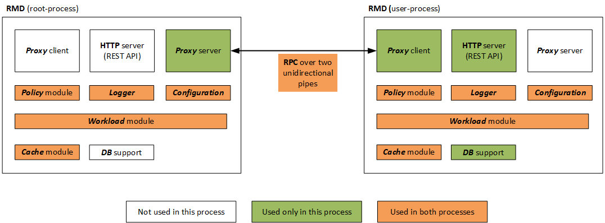
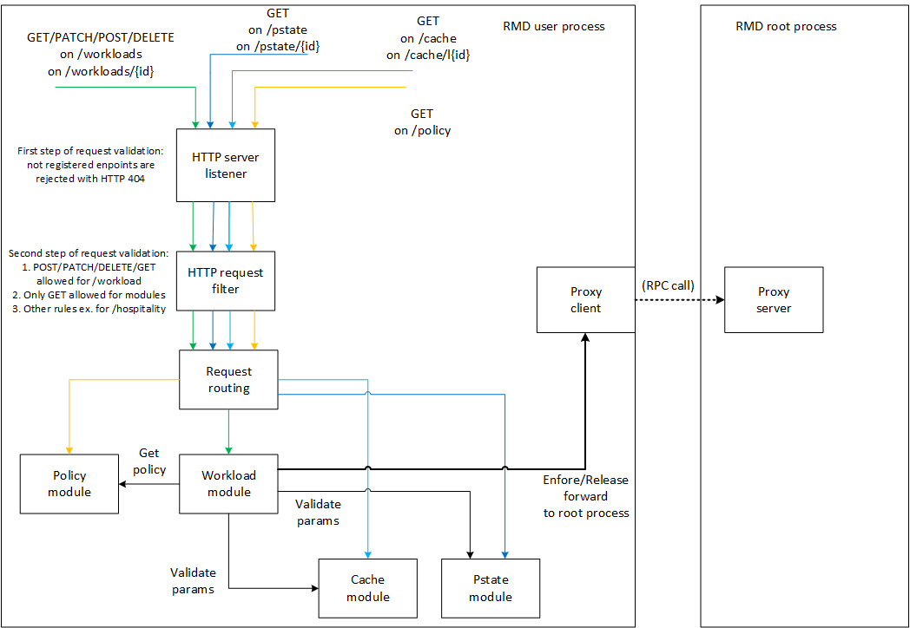
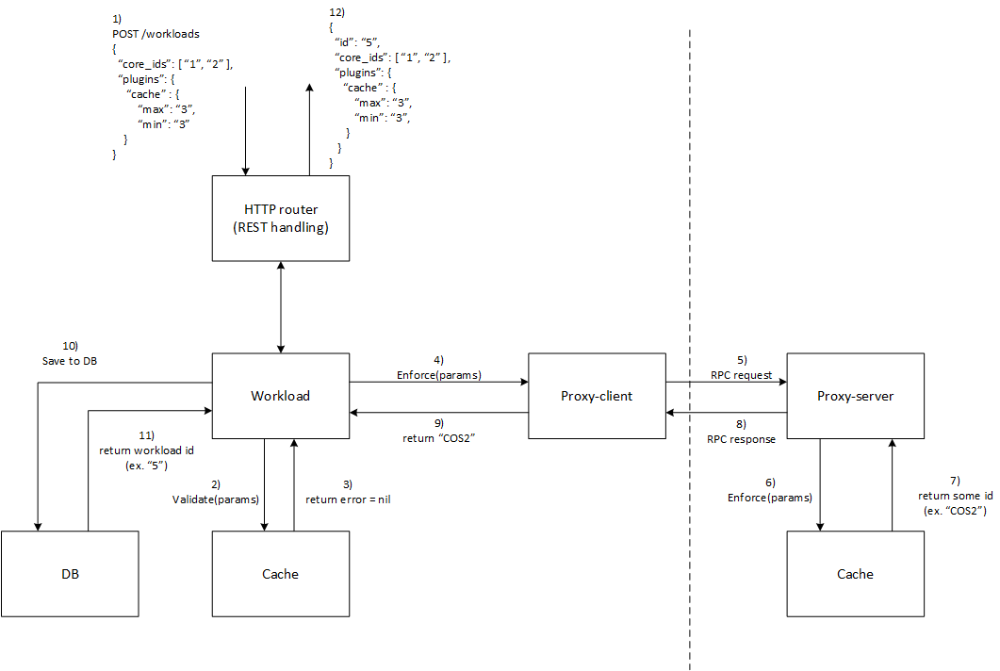
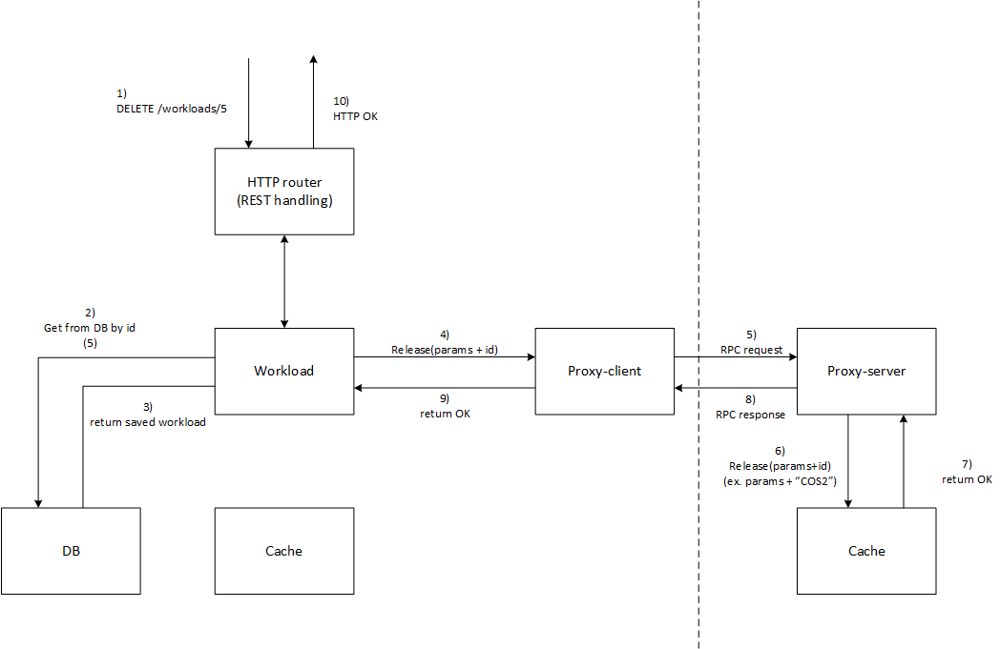

# RMD loadable plugin development guide

This document provides necessary information about developing plugins (dynamically loadable modules) for [Resource Management Daemon](https://github.com/intel/rmd).

RMD is managing resources by assigning some (set of) resource(s) or tweaking platform settings for specified core or application. This set of assignments/tweaks in RMD is called *workload* and contains at least following params:

* set of CPU core numbers (exchangeable with process ids) - defines which core(s) should have guaranteed/limited resources
* set of process ids (exchangeable with core ids) - defines which application(s) should have guaranteed/limited resources
* resource(s) description(s) - set of params that defines resource expansion/limitation for given core(s)/application(s)

The RMD *workload* contains also other parameters like *cos_name* (Class Of Service) or *policy* (predefined, named set of params for different modules) but they are not needed for loadable plugins explanation and will not be covered in the document. For more information please refer to [RMD documentation](https://github.com/intel/rmd/tree/master/docs).

## RMD implementation details and data flows

### RMD architecture and launch process

To fully understand how plugins are used in RMD one has to be familiar with RMD implementation and launching process.

RMD is a single executable binary file (excluding plugins) that contains all application code: configuration parsers, HTTP server for REST API, database support, logging service, RPC modules (more about this later in the document), access to platform and many others. For security reasons it is good to separate HTTP server (that is user input, parsing mechanism and so) and code that directly accesses the platform. In RMD this separation is provided by launching two processes of which one has lower privileges.

Please take a look on picture below:


At the beginning RMD is launched as a single process with *root* privileges. Just after start this RMD process creates two *pipes* for communications, forks separate process and launches same RMD binary but with lower privileges (user *rmd*). These two processes execute concurrently and communicate using *pipes* created before forking. For better readability, starting from this point *root-process* will be used for RMD launched as *root* and *user-process* will be used to describe forked RMD with lower privileges.

As it was already stated both processes are using same binary but provide different functionality. To handle this situation each of the processes checks system user id and based on this information selects which part of code should be executed. Process that has user id equal 0 (*root-process*) is responsible for preparing pipes, initializing database (but owner is changed to user *rmd*) and forking *user-process*. It also initializes *proxy-server* module for RPC connection over pipes.

After it's launched, the *user-process* starts HTTP server for incoming REST API requests and initializes *proxy-client* module for sending requests to *root-process*. It uses database created by root process for storing *workloads*. Picture below presents both processes with marked parts of code that are initialized (only logical modules described in this documents are shown):



At this point both processes are up and running.

### REST API requests processing in RMD

REST API is provided by HTTP server running on *user-process*. As in case of standard HTTP requests (accessing web page), arriving REST requests are at first place matched to the known paths called *endpoints*. When request to unknown (not registered) endpoint is received server responds with "404 Not found" without further content validation. Request that matches registered endpoint is forwarded to handler functions

**NOTE** Further description is mentioning endpoints' using only partial paths like */workloads* or */policy* without giving full URL that can contain API version that is */v1/workloads* and */v1/policy* respectively.

Requests handling differ depending on endpoint and HTTP method. In case of */workloads*, the main endpoint in RMD API, supported methods are *GET*, *POST*, *PATCH* and *DELETE*. *POST* and *PATCH* requests have to carry data in json forma with valid RMD workload description (check [RMD documentation](https://github.com/intel/rmd/tree/master/docs) for details) including parameters for RMD modules. It is the only accepted way to pass any parameters to modules (make changes in assigned resources).

Another always supported RMD REST endpoint is */policy*. This endpoint accepts only *GET* method and allows to check policies known in this working RMD instance. Is it handled by internal *policy* module. This module is used by *workload* implementation to map policy name specified in workload description into set of parameters for modules. It does not allow to change the policy loaded from file neither change any other setting in host machine.

RMD can expose also other REST endpoints related to specific loaded modules. It can be for example */cache* for RDT CAT supporting module and */pstate* for CPU frequency manipulation module. Each module can expose one endpoint, multiple endpoints or no endpoint at all depending on it's specifics. It's module's responsibility to declare endpoints but it's RMD who registers and initially filters requests. Modules does not declare accepted HTTP methods for it's endpoints as only *GET* is allowed and so registered by RMD.

### Workload REST requests handling

As it was mentioned in previous sections */workloads* is the most complex REST endpoint in RMD as it supports multiple methods. Additionally *workload* module operates on another loaded RMD modules to set resources for cores/processes.

Workload request handling is implemented based on following flow:

1. HTTP REST request for */workloads* endpoint arrive to HTTP server on *user-process*
2. Request is forwarded to handler in *workload* module
3. Handler validates the request:
    1. In case of POST or PATCH request data in json format is needed
        * provided json data shall follow defined structure
4. Parameters for plugins are extracted from json data
    1. json data can contain policy name instead of params for each module
    2. in such situation policy is fetched from *policy* module
    3. if selected policy does not exists, error is returned
    3. if policy exists params for each module are taken from policy
5. For each module declared in json data (or policy) *workload* module performs validation:
    1. checks if module is loaded - if not error is returned
    2. calls validation function of given module with parameters specified for this module
    3. if any module returns error from it's validation function then *workload* returns failure for such REST request
6. When params for all modules are validated then *workload* tries to send them to platform using *proxy-client*
    1. *workload* can send only *enforce* and *release* requests for setting the params and removing the settings respectively
    2. error on this action is not be common (parameters have been validated) but can occur due to some platform errors
    3. in case of error:
        * *workload* module returns error for request
7. When all modules specified in request are successfully processed, *workload* returns success for REST request
8. Response is sent back to REST API client

For sake of simplicity description above does not contain additional steps like checking existence of workload with given *id* in database (for PATCH or DELETE) or validating workload for overlapping cpus/tasks list.

### Proxy usage by workload module

Proxy mechanism implemented in RMD allows to transfer requests between *user-process* and *root-process*. Also it can be additional filtering mechanism as *proxy-server* should handle only limited set of requests and drop anything else.

When calling *proxy-client* workload has to provide 3 kinds of data:
- name of module to be used
- type of request (release/enforce) to be executed
- set of parameters to be passed to module

*proxy-client* is sending all these information as a request to *proxy-server* over RPC. When *proxy-server* receives the request, it first checks if selected module is loaded and if specified request type is supported. If yes it calls appropriate function (Enforce() or Release() - nothing more is supported) and returns execution result as a request result. If this initial check fails then error is reported immediately without any other action.

Result returned by *proxy-server* is sent back over RPC to *proxy-client* and then to *workload* module (point *6* in previous section).

### REST requests flow summary

All REST API request processing steps, described in previous sections are presented on picture below. Colored lines represents HTTP request processing for different endpoints. Black lines refers to function calls and data flow without usage of HTTP objects like json string or HTTP request structure).



Please bare in mind, that for picture simplicity, some steps like authentication and database update have been omitted.

### Parameter setting on the platform

During it's lifetime RMD is changing platform resource assignments multiple times based on received request to workload module. There are three possible scenarios of workloads database modification (and so the resource assignment changes):

1. New configuration setting
    * when resource request for some application (ex. some VM) arrives
    * example: HTTP PUT ot POST command in REST API
    * done in *workload* module in *Enforce* flow
2. Configuration removal
    * when application closed or resource not assigned anymore
    * example: HTTP DELETE command in REST API
    * done in *workload* module in *Release* flow
3. Configuration update
    * when resources assigned to application change (increase or decrease)
    * example: HTTP PATCH command in REST API
    * realized in *workload* module as two flows *Release* for old setting and *Enforce* for new one

List above presents only actions related to resource modification. In some cases there can be also need of returning platform configuration related to specific plugin (directly to user by HTTP GET command or through some internal RMD flow).

### Additional requirement for *Enforce()* function

When operating on workloads, RMD uses workload id for getting information about workload or updating and deleting existing workloads. It is highly probable that plugins will also need additional parameter to identify existing (already enforced) configuration during resource release. For this purpose plugin's *Enforce()* function should be able to return allocated resource identifier for further use in release flow.

Please see workload POST with Cache Enforce() example on diagram below:



The "id" parameter returned from enforce flow through *proxy-client* will be is stored in RMD database. When PATCH or DELETE request will be received by RMD the appropriate *Release()* call will receive all workload parameters for given module and additionally previously obtained "id":




## Loadable module development

Loadable module implementation should follow all rules and meet all the requirements presented in previous chapters of this document. Even if some specific module does not provide/support particular functionality the interface between RMD and it's Plugin should be consistent.

Below is the list of necessary functions that has to be provided by each external, loadable RMD module:

1. Initialization function - used to pass all required parameters, mainly plugin configuration options from rmd.toml
2. REST API endpoints declaration function - it is needed to inform RMD which endpoints should be exposed on northbound API. Requests (only with GET method) for these endpoints will be forwarded to module
3. Request handling function - will be called by request router when HTTP request for this module's endpoint arrives
4. Validate function - used by *workload* module to check if parameters received in workload description (json data in HTTP request) are valid
5. *Enforce* and *Release* flow functions - they will be called by *worklaod* module (through *proxy-client* - *proxy-server* pair) during platform resource manipulation

### ModuleInterface design

To meet all requirements listed in [previous section](#loadable-module-development) following module interface specification written in Go language has been created:

```go
type ModuleInterface interface {
    // Initialize is a module initialization function
    // config param contains all information needed to initialize plugin
    // (ex. path to config file)
    Initialize(params map[string]interface{}) error

    // GetEndpointPrefixes returns declaration of REST endpoints handled by this module
    // If function's implementation for specific module returns:
    // { "/endpoint1" and "/endpoint2/" } 
    // then RMD will expose and forward to this module requests for URI's:
    // - http://ip:port/v1/endpoint1
    // - http://ip:port/v1/endpoint2/ 
    // - all http://ip:port/v1/endpoint2/{something}
    GetEndpointPrefixes() []string
    
    // HandleRequest is called by HTTP request routing mechanism
    HandleRequest(wrt http.ResponseWriter, req *http.Request) error

    // Validate allows workload module to check parameters before trying to enforce them
    Validate(params map[string]interface{}) error

    // Enforce allocates resources or set platform params according to data in 'params' map
    // Returned string should contain identifier for allocated resource.
    // If plugin does not need to store any identifier for future use in Release() then string should be empty
    Enforce(params map[string]interface{}) (string, error)

    // Release removes setting for given params
    // (in case of pstate it will be just disabling of monitoring for specified cores)
    Release(params map[string]interface{}) error
}
```

To ensure full compatibility additional constraints are defined:

1. *workload* in RMD can be specified for core ids *OR* process (task) ids so only one of *cpus* and *tasks* parameter will be placed in *params* argument for *Validate()*, *Enforce()* and *Release()* calls
2. if module is not exposing any REST endpoint it should return empty slice from *GetEndpointPrefixes()* function
3. type of parameters in HandleRequests() are taken from *net/http* package from Go standard library

### Building the plugin for RMD

When using Go *plugin* package for .so library loading there has to be some well known symbol to be fetched by application. It shall have proper name and type so the application can load it and cast to usable object. Also package name is predefined.

In case of RMD loadable module following requirements have to be met:

* exported symbol name has to be **Handle**
* symbol type has to implement all functions defined in [**ModuleInterface**](#moduleinterface-implementation)
* package name has to be **main** as in case of application (*NOTE* **main()** function is not needed but some code analysis tools can complain if it's missing)

To build loadable plugin instead of executable proper Go build mode has to be used:

```bash
go build -buildmode=plugin -o output_directory/plugin_file.so ./
```

## Things to be done/decided/investigated

1. Implementation tasks to be done for new architecture
    1. workload description (json) and structure (RDTworkload) update (partially prepared by Michal)
    2. configuration file and parsing function update to support multiple plugins:
        * modules loading based on configuration 
        * to be decided: what to do when one of modules broken/can't be loaded
        * storing modules in map
        * registering modules' REST endpoints
    3. proxy client and server refactoring to handle modules
        * module and function name passing over RPC - as string "module.request" or as two values in *params* map
        * direct Enforce()/Release() calling by proxy-server on specified module
        * in first phase support only for P-State and Cache
    4. workload module refactoring:
        * checking if module described in json is loaded
        * param (from json) validation before enforce/release using new Validate() method
        * calling proxy client for enforce/release
        * "cos_name" is now a workload param while in facts it's a cache internal value
    5. HTTP REST handling/routing refactoring:
        * to be decided: usage of simple net/http from Go, emicklei/go-restful or gorilla/mux package
        * forwarding GET method calls to modules
        * workload, policy, mba and hospitality support temporary without change
    6. P-State implementation update for new interface
    7. Cache module refactoring to support new worklflow
        * Enforce() and Release() refactored to new signature
        * Validate() added and used in workload
        * in general: preparation for future extraction to module
2. Currently *Enforce()* and *Release()* functions are not returning any object - only error
    * for P-State it is OK but it should be investigated if other modules can need something more
